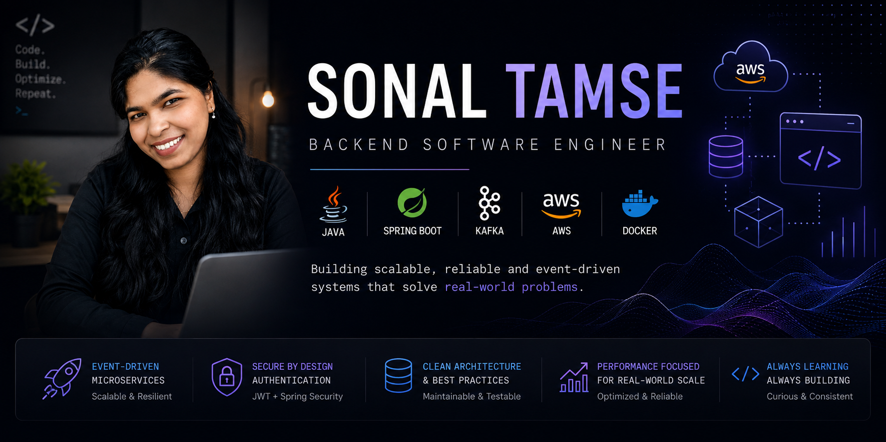

<p align="center">
  
</p>

<h1 align="center">Hi 👋, I'm Sonal Tamse</h1>

<p align="center">
  
</p>

## 👩‍💻 About Me

I'm a Backend Software Engineer passionate about building reliable, scalable, and maintainable backend systems.

I enjoy designing REST APIs, event-driven architectures, secure authentication systems, and cloud-native applications using Java and Spring Boot.

Currently exploring distributed systems, Kafka, Kubernetes, and advanced system design while continuously improving my engineering skills.

## 🛠 Tech Stack

<p align="center">

</p>

## 💻 Developer Card

```text
sonal@github
────────────────────────────────────────────

Role        : Software Engineer II

Company     : Solera

Languages   : Java • JavaScript • PHP

Backend     : Spring Boot
              Spring Security
              REST APIs
              Node.js

Messaging   : Kafka

Cloud       : AWS

Databases   : PostgreSQL
              MySQL
              Redis

Tools       : Docker
              Git
              IntelliJ IDEA

Currently   : Learning Kubernetes
              Distributed Systems

Goal        : Build scalable systems at scale 🚀
```

## 📊 GitHub Analytics

<p align="center">


</p>

<p align="center">

</p>

## 🚀 Featured Projects

### 🛒 Async Commerce Engine
Event-driven microservices built using Spring Boot and Kafka for asynchronous order processing.

### 🔐 Identity Access Management
Secure authentication service with JWT, Spring Security, and role-based authorization.

### 🛍 Spring Boot Ecommerce Backend
Production-inspired REST API with authentication, persistence, and cloud-ready architecture.

### 📨 NotifyIQ
Extensible notification platform demonstrating clean architecture and design patterns.

## 🎯 Current Focus

- Building scalable backend systems
- Event-driven microservices
- Distributed systems
- Kafka-based architectures
- Cloud-native Java applications

## 🤝 Let's Connect

<p align="center">

<a href="https://www.linkedin.com/in/thesonaltamse">

</a>

<a href="mailto:sonaltamse@gmail.com">

</a>

</p>
