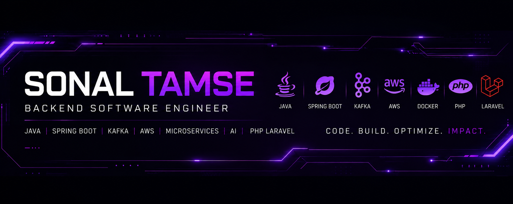

  

  
  &nbsp;&nbsp;&nbsp;
  
  &nbsp;&nbsp;&nbsp;
  

  <strong>Backend Software Engineer · Java · Spring Boot · Distributed Systems · AWS</strong>

  3+ years of professional software engineering experience

About

Backend Software Engineer specializing in Java, Spring Boot, distributed systems, and cloud-native backend development.
Experienced in designing and developing backend services, REST APIs, event-driven workflows, asynchronous processing pipelines, and secure application architectures.

Core Engineering
Java & Spring Boot backend development
REST API and microservice design
Event-driven architectures with Apache Kafka and RabbitMQ
Asynchronous and distributed processing
AWS-based cloud infrastructure
Docker, Kubernetes, and CI/CD automation
Relational and NoSQL data stores
Authentication and authorization using Spring Security and JWT
LLM API integration and AI-powered backend applications
Performance-oriented database and application design

Technical Stack

Languages

  

Backend & Frameworks

  

Java: Spring Boot · Spring Security · Spring Data JPA · HibernateJavaScript: Node.js · Express.jsPHP: LaravelAPIs: REST · JSON · API Design · Validation · Error Handling

Distributed Systems & Messaging

  

Apache Kafka · RabbitMQ · Event-Driven Architecture · Asynchronous Processing · Microservices · Distributed Systems

Databases & Caching

  

PostgreSQL · MySQL · MongoDB · Redis · JPA/Hibernate · Database Design · Query Optimization · Caching

Cloud & Infrastructure

  

AWS EC2 · AWS S3 · AWS RDS · Docker · Kubernetes · Apache · GitHub Actions · CI/CD

AI & Developer Tools

  

LLM API Integration · Google GenAI · GitHub Copilot · AI-Powered Code Review · AI-Assisted Development

GitHub Activity

  
  

  

