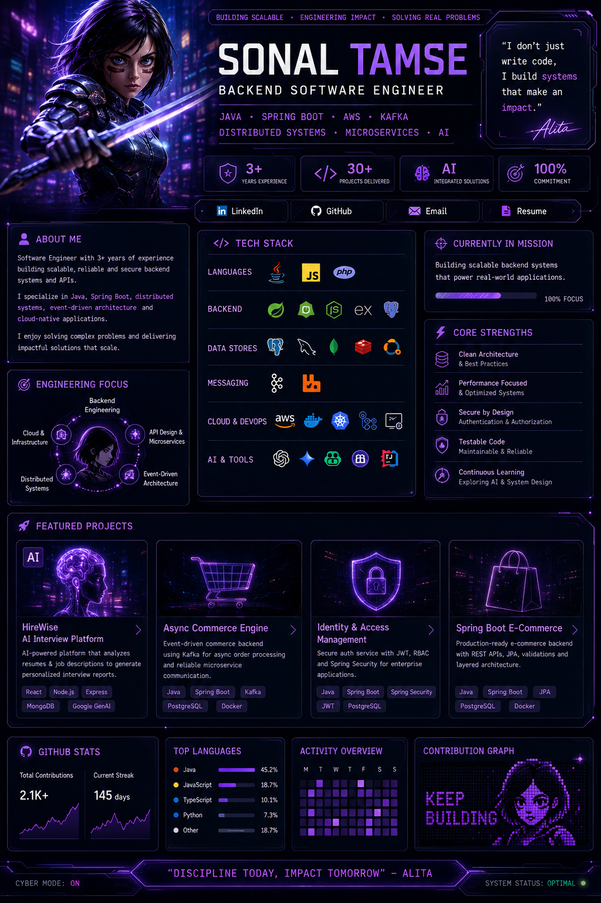

<!-- ========================================================= -->
<!--                         HERO                              -->
<!-- ========================================================= -->

<p align="center">
  
</p>

<h1 align="center">Sonal Tamse</h1>

<p align="center">
  
</p>

<p align="center">
  <strong>
    Backend Engineering · Distributed Systems · Cloud · AI
  </strong>
</p>

<p align="center">
  <a href="https://www.linkedin.com/in/thesonaltamse">
    LinkedIn
  </a>
  &nbsp; • &nbsp;
  <a href="https://github.com/sonaltamse">
    GitHub
  </a>
  &nbsp; • &nbsp;
  <a href="mailto:sonaltamse@gmail.com">
    Email
  </a>
</p>

<br>

<p align="center">
  
</p>


<!-- ========================================================= -->
<!--                    ENGINEERING PROFILE                    -->
<!-- ========================================================= -->

## ⚡ Engineering Profile

<table align="center">
  <tr>

    <td align="center" width="200">
      <strong>3+ Years</strong><br>
      Professional Experience
    </td>

    <td align="center" width="200">
      <strong>Backend</strong><br>
      Java · Spring Boot
    </td>

    <td align="center" width="200">
      <strong>Distributed</strong><br>
      Kafka · Async Systems
    </td>

    <td align="center" width="200">
      <strong>Cloud</strong><br>
      AWS · Docker · Kubernetes
    </td>

  </tr>
</table>


<!-- ========================================================= -->
<!--                         ABOUT                             -->
<!-- ========================================================= -->

## 👩‍💻 About Me

Software Engineer with **3+ years of professional experience** building
backend services, APIs, microservices, and cloud-based applications.

My primary engineering focus is **Java and Spring Boot**, with hands-on
experience across event-driven architectures, asynchronous processing,
AWS infrastructure, databases, CI/CD, security, and AI-powered application
integrations.

I work across the backend lifecycle — from API and data-model design through
implementation, testing, deployment, performance optimization, and
production troubleshooting.

I care about building systems that are **scalable, reliable, maintainable,
and observable**.


<!-- ========================================================= -->
<!--                    ENGINEERING STACK                      -->
<!-- ========================================================= -->

## ⚙️ Engineering Stack

### Languages

`Java` `JavaScript` `SQL` `PHP`

### Backend

`Spring Boot` `Spring Security` `Spring Data JPA` `Hibernate`

`Node.js` `Express.js` `REST APIs` `Microservices`

### Distributed Systems & Messaging

`Apache Kafka` `RabbitMQ`

`Event-Driven Architecture`

`Asynchronous Processing`

`Distributed Systems`

`Caching`

### Databases

`PostgreSQL` `MySQL` `MongoDB` `Redis`

### Cloud & Infrastructure

`AWS EC2` `AWS S3` `AWS RDS`

`Docker` `Kubernetes`

`GitHub Actions` `CI/CD`

`Apache`

### AI Engineering

`LLM API Integration`

`Google GenAI`

`AI-Powered Code Review`

`GitHub Copilot`

`AI-Assisted Development`

### Engineering Practices

`System Design`

`Object-Oriented Design`

`Design Patterns`

`API Design`

`Database Design`

`Authentication & Authorization`

`Performance Optimization`

`Automated Testing`


<!-- ========================================================= -->
<!--                     TECHNOLOGIES                          -->
<!-- ========================================================= -->

## 🧩 Technology Matrix

<p align="center">
  
</p>


<!-- ========================================================= -->
<!--                  ENGINEERING FOCUS                        -->
<!-- ========================================================= -->

## 🧠 Engineering Focus

<p align="center">

```text
                    ┌────────────────────────┐
                    │  BACKEND ENGINEERING   │
                    └────────────┬───────────┘
                                 │
                                 ▼
                    ┌────────────────────────┐
                    │ API DESIGN &           │
                    │ MICROSERVICES          │
                    └────────────┬───────────┘
                                 │
                                 ▼
                    ┌────────────────────────┐
                    │ EVENT-DRIVEN            │
                    │ ARCHITECTURE            │
                    └────────────┬───────────┘
                                 │
                                 ▼
                    ┌────────────────────────┐
                    │ DISTRIBUTED             │
                    │ SYSTEMS                 │
                    └────────────┬───────────┘
                                 │
                                 ▼
                    ┌────────────────────────┐
                    │ CLOUD &                 │
                    │ INFRASTRUCTURE          │
                    └────────────┬───────────┘
                                 │
                                 ▼
                    ┌────────────────────────┐
                    │ SCALABILITY &            │
                    │ RELIABILITY              │
                    └────────────┬───────────┘
                                 │
                                 ▼
                    ┌────────────────────────┐
                    │ SYSTEM DESIGN            │
                    └────────────────────────┘
</p> <!-- ========================================================= --> <!-- SELECTED WORK --> <!-- ========================================================= -->
🚀 Selected Work
🤖 HireWise

AI-powered interview preparation platform

A full-stack application that analyzes resumes and job descriptions and
generates structured, personalized interview preparation reports.

Engineering
Designed REST APIs using Node.js and Express
Integrated Google GenAI for resume and job-description analysis
Designed structured LLM responses for reliable application consumption
Implemented persistent report storage using MongoDB and Mongoose
Built JWT-based authentication with secure cookies
Implemented resume upload and PDF parsing
Built report generation, retrieval, and history APIs
Developed the React/Vite reporting interface

Stack: React · Vite · Node.js · Express · MongoDB · Mongoose · Google GenAI

🛒 Async Commerce Engine

Event-driven order processing platform

Backend system designed around asynchronous processing and event-driven
communication between services.

Engineering
Designed backend services using Java and Spring Boot
Implemented asynchronous communication using Apache Kafka
Designed event-driven order processing workflows
Implemented transactional persistence
Established service boundaries between microservices
Applied clean architecture and separation of concerns
Designed components with scalability and reliability in mind

Stack: Java · Spring Boot · Kafka · PostgreSQL · Docker

🔐 Identity & Access Management

Secure authentication and authorization service

Backend service providing authentication and authorization capabilities
for distributed applications.

Engineering
Implemented JWT-based authentication
Implemented role-based access control
Integrated Spring Security
Designed authentication and authorization boundaries
Secured REST endpoints
Implemented request validation and error handling

Stack: Java · Spring Boot · Spring Security · JWT · PostgreSQL

🛍️ Spring Boot E-Commerce Backend

Production-oriented e-commerce backend

Backend application demonstrating REST API design, persistence,
authentication, and service-layer architecture.

Engineering
Designed RESTful APIs for core business workflows
Implemented persistence using Spring Data JPA and Hibernate
Designed relational data models
Implemented authentication and authorization
Added validation and centralized exception handling
Applied layered architecture and separation of concerns

Stack: Java · Spring Boot · Spring Data JPA · PostgreSQL · Docker

<!-- ========================================================= --> <!-- AI ENGINEERING --> <!-- ========================================================= -->
🤖 AI Engineering

I integrate AI capabilities into applications and engineering workflows,
with a focus on practical LLM integration within software systems.

                     ┌──────────────────┐
                     │     LLM APIs     │
                     └────────┬─────────┘
                              │
              ┌───────────────┼───────────────┐
              │               │               │
              ▼               ▼               ▼
       AI Applications   AI Code Review   Dev Productivity
              │               │               │
              └───────────────┼───────────────┘
                              │
                              ▼
                    Backend Integration
Experience
LLM API integration
Google GenAI
Structured LLM responses
AI-powered application features
AI-powered code review
GitHub Copilot
AI-assisted development workflows
Integrating AI services into backend architectures
<!-- ========================================================= --> <!-- ARCHITECTURE & PRACTICES --> <!-- ========================================================= -->
🏗️ Architecture & Engineering
Area	Focus
Backend	Java · Spring Boot · REST APIs · Microservices
Architecture	Distributed Systems · Event-Driven Architecture
Messaging	Kafka · RabbitMQ · Asynchronous Processing
Cloud	AWS · Docker · Kubernetes
Data	PostgreSQL · MySQL · MongoDB · Redis
Security	Spring Security · JWT · RBAC
AI	LLM APIs · Google GenAI · AI-assisted engineering
Delivery	GitHub Actions · CI/CD · Automated Testing
Performance	Caching · Query Optimization · Scalable Services
<!-- ========================================================= --> <!-- GITHUB ACTIVITY --> <!-- ========================================================= -->
📊 GitHub Activity
<p align="center">


</p> <p align="center">


</p> <!-- ========================================================= --> <!-- CONTRIBUTION ANIMATION --> <!-- ========================================================= -->
🐍 Contribution Activity
<p align="center">  </p> <!-- ========================================================= --> <!-- CONNECT --> <!-- ========================================================= -->
🌐 Connect
<p align="center"> <a href="https://www.linkedin.com/in/thesonaltamse">  </a>

   

<a href="https://github.com/sonaltamse">  </a>

   

<a href="mailto:sonaltamse@gmail.com">  </a> </p> <br> <p align="center">  </p> <p align="center"> <sub> Building scalable systems · Engineering for reliability · Solving real problems </sub> </p> ```
│
